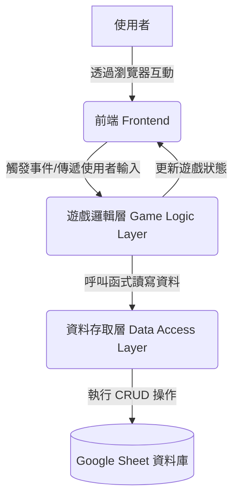

# 軟體設計文件 (Software Design Document - SDD)
## 1. 需求分析 (Requirement Analysis)

### 1.1 專案目標 (Project Goal)
- 建立一個遊戲化的運動激勵系統，以 RPG 的形式包裝，旨在透過三人合作的冒險，鼓勵使用者完成運動任務，並提供互相支援的互動機制。
- 目的在於將運動過程轉化為有趣且有成就感的遊戲體驗，提升運動頻率與持續性。

### 1.2 目標使用者 (Target Users)
- **主要使用者**：由三位成員組成的小隊，希望透過遊戲化方式互相激勵並完成運動目標的玩家。
- **使用者具備條件**：無需程式開發經驗，對基礎網頁操作有概念。

### 1.3 核心功能需求 (Functional Requirements)

#### 1.3.1 遊戲初始化與設定
- **FR001**：系統應允許使用者設定遊戲隊伍名稱。
- **FR002**：系統應允許三位玩家分別輸入角色名稱並選擇職業 (劍士、法師、盜賊、弓箭手、牧師)。
- **FR003**：系統應根據所選職業初始化角色的初始數值 (HP, MP, EXP) 和初始技能。

#### 1.3.2 每週遊戲循環
- **FR004**：系統應提供開始新一週遊戲循環的功能。
- **FR005**：新一週開始時，系統應重置所有玩家的技能使用次數。
- **FR006**：新一週開始時，系統應隨機抽取一張「事件卡」（全隊共用），並顯示其效果。
- **FR007**：新一週開始時，系統應為每位玩家隨機抽取一張「怪物卡」（難度依地圖設定），並顯示其任務、時限、成功/失敗獎懲。

#### 1.3.3 任務管理與回報
- **FR008**：系統應為每位玩家顯示其當前怪物任務的詳細資訊 (項目、時限、獎懲)。
- **FR009**：系統應允許玩家回報「完成」或「失敗」當前怪物任務。
- **FR010**：系統應根據任務回報結果，自動更新玩家的 EXP 和 HP 數值。
- **FR011**：成功擊敗怪物後，系統應允許玩家再次抽取一張怪物卡。
- **FR012**：系統應追蹤任務時限，並在逾期未回報時自動判定為失敗並扣除 HP。

#### 1.3.4 角色數值與成長
- **FR013**：系統應顯示每位玩家的當前 HP、MP、EXP、等級、職業和被動技能。
- **FR014**：當玩家 EXP 累積達到升級條件 (10 EXP) 時，系統應自動觸發升級流程。
- **FR015**：升級時，系統應增加玩家的 HP 上限和 MP 上限，並回滿 HP 和 MP。
- **FR016**：升級時，系統應允許玩家抽取一張新的「被動技能卡」。
- **FR017**：系統應支援 MP 的恢復機制 (例如：戶外打卡、分享開心事)。

#### 1.3.5 技能使用與團隊互動
- **FR018**：系統應顯示玩家擁有的主動技能及其 MP 消耗和使用限制。
- **FR019**：系統應允許玩家使用主動技能，並能選擇目標隊友。
- **FR020**：系統應根據技能效果自動更新相關玩家的 HP、MP、怪物難度、任務時限等數值。
- **FR021**：系統應支援合體技 (Duo Strike, Trinity Burst) 的觸發與結算。

#### 1.3.6 地圖與 BOSS
- **FR022**：系統應顯示當前地圖進度。
- **FR023**：系統應在特定地圖階段觸發 BOSS 戰。
- **FR024**：BOSS 戰應包含合作達成條件 (小隊累計運動時間、個人指定行動)。
- **FR025**：系統應根據 BOSS 戰結果結算獎勵並解鎖下一地圖。

#### 1.3.7 資料持久化與更新
- **FR026**：所有遊戲相關數據 (玩家狀態、隊伍進度、怪物/事件卡庫) 應儲存在 Google Sheets 中。
- **FR027**：系統應能從 Google Sheets 讀取初始化資料和最新遊戲狀態。
- **FR028**：所有遊戲內的數值變動和狀態更新應即時寫回 Google Sheets。

#### 1.3.8 每週總結
- **FR029**：系統應在每週末提供一個總結頁面，回顧本週所有玩家的進度與數據變化。

### 1.4 非功能需求 (Non-Functional Requirements)
- **NFR001**：**可用性 (Usability)**：應用程式介面應直觀、簡潔，易於初次使用者理解和操作。
- **NFR002**：**性能 (Performance)**：讀取和寫入 Google Sheets 的操作應在可接受的時間範圍內完成，不應造成明顯延遲。
- **NFR003**：**可靠性 (Reliability)**：應用程式應穩定運行，減少當機或數據錯誤。
- **NFR004**：**可維護性 (Maintainability)**：程式碼應結構清晰，易於理解和修改。
- **NFR005**：**可部署性 (Deployability)**：應用程式應能透過 Streamlit Community Cloud 部署到公共網址，供隊友遠端存取。
- **NFR006**：**安全性 (Security)**：與 Google Sheets 的連接應遵循 Google 的安全規範，保護使用者數據。
- **NFR007**：**相容性 (Compatibility)**：應用程式應能在主流現代網頁瀏覽器上正常運行。

---
## 2. 高階設計 (High-Level Design)

### 2.1 系統架構 (System Architecture)
本系統將採用經典的 **三層式架構 (Three-Tier Architecture)**，將應用程式的功能劃分為三個邏輯層次：**前端 (Frontend)**、**遊戲邏輯層 (Game Logic Layer)** 和 **資料存取層 (Data Access Layer)**。此架構能有效分離關注點，提高程式碼的可維護性和擴充性。

### 2.2 模組職責 (Module Responsibilities)

#### 2.2.1 前端 (Frontend / UI Layer)
- **技術棧**: `Streamlit`
- **核心職責**:
    - **呈現**: 負責產生使用者看得到的網頁介面，包含顯示角色狀態、任務資訊、技能列表等。
    - **互動**: 捕捉使用者的所有輸入，例如點擊按鈕、從下拉選單中選擇選項等。
    - **觸發**: 將使用者的互動轉化為對「遊戲邏輯層」的函式呼叫。
- **此模組不包含任何核心遊戲規則的計算。**

#### 2.2.2 遊戲邏輯層 (Game Logic Layer)
- **技術棧**: `Python`
- **核心職責**:
    - **大腦**: 作為應用程式的核心，實現所有在需求分析階段定義的遊戲規則。
    - **流程控制**: 管理遊戲的整體流程，例如每週循環、回合制戰鬥、升級流程等。
    - **狀態管理**: 處理來自前端的請求，計算數值變化，並決定需要更新哪些資料。
    - **協調者**: 呼叫「資料存取層」來讀取或保存遊戲狀態。
- **範例函式**: `start_new_week()`, `use_skill(player_id, skill_id, target_id)`, `complete_monster_task(player_id)`.

#### 2.2.3 資料存取層 (Data Access Layer)
- **技術棧**: `Python` + `gspread` 函式庫
- **核心職責**:
    - **資料庫窗口**: 作為唯一與 Google Sheets 互動的通道。
    - **抽象化**: 將所有與 `gspread` 相關的具體操作（例如選定工作表、讀取儲存格範圍、更新特定列）封裝成簡單、語意化的函式。
    - **提供介面**: 為「遊戲邏輯層」提供清晰的 API 來存取資料，例如 `get_player_by_name(name)`, `update_player_stats(player_data)`, `get_all_monsters()`。
- **此設計讓遊戲邏輯層無需關心資料到底是如何儲存的，未來若想更換資料庫 (例如從 Google Sheets 換成 SQL 資料庫)，只需修改此層即可。**

---
## 3. 細節設計 (Detailed Design)
本章節整合 `SDD_codex.md` 的核心設計，作為程式開發的具體依據。

### 3.1 資料模型 (Database Schema)
資料庫將由 Google Sheet 內的多個工作表構成。

- **`首頁`**: 用於顯示當前週數、地點、事件摘要、玩家狀態看板等全域資訊。
- **`角色狀態表`**:
    - **欄位**: `玩家`, `職業`, `等級`, `EXP`, `HP當前`, `HP上限`, `MP當前`, `MP上限`, `技能摘要`
- **`任務列表`**:
    - **欄位**: `怪物ID`, `玩家`, `怪物名稱`, `難度`, `任務內容`, `時限(天)`, `成功EXP`, `失敗-HP`, `開始日`, `截止日`, `狀態(✅/⚔️/☠️)`
- **`技能狀態`**:
    - **欄位**: `玩家`, `職業`, `技能ID`, `技能名稱`, `主被動`, `MP消耗`, `啟用狀態`, `顯示字串`, `每週可用總次數`, `剩餘次數`, `重置規則`, `技能效果說明`
- **`事件表`**:
    - **欄位**: `事件編號`, `類型`, `名稱`, `效果代碼`, `敘述`, `事件影響(數值)`, `說明`
- **`怪物表`**:
    - **欄位**: `怪物編號`, `分類`, `名稱`, `敘述`, `等級(易/中/難)`, `任務內容`, `時限(天)`, `成功EXP`, `失敗HP`, `備註`
- **`紀錄頁面`**: 用於記錄所有狀態變更的歷史日誌。
    - **欄位**: `日期`, `週數`, `玩家`, `類型`, `代碼`, `名稱`, `效果說明`, `對象`, `HP變化`, `MP變化`, `EXP變化`, `當前HP/MP/EXP`
- **`等級資料表`**:
    - **欄位**: `等級`, `HP上限累計增量`, `MP上限累計增量`, `升級所需累積 EXP`
- **`職業技能表`**:
    - **欄位**: `技能編碼`, `職業`, `技能名稱`, `主被動`, `消耗MP`, `效果數值`, `每週可用次數`, `重置規則`, `技能敘述`
- **`清單表`**: 用於儲存各種枚舉值與對照表，如職業列表、任務狀態圖示等。

### 3.2 資料列舉與對照 (Enums & Mappings)
- **任務狀態**: `✅擊殺` | `⚔️進行中` | `☠️失敗`
- **事件類型**: 增益(B) / 挑戰(D) / 中立(N)
- **技能類型**: 主動(A) / 被動(P)
- **事件效果代碼**: `ALL_MP+1`, `ALL_HP+2`, `ALL_MONSTER_LV+1`, `MONSTER_TIME-1_DAY` 等，用於程式化處理事件效果。

### 3.3 核心流程摘要 (Core Logic Summary)
- **週初始化**:
    1.  **抽事件**: 從 `事件表` 隨機抽取一筆，記錄其效果。
    2.  **抽怪物**: 為每位玩家從 `怪物表` 隨機抽取一筆，寫入 `任務列表`，並設定開始與截止日期。
    3.  **重置技能**: 根據 `技能狀態` 的重置規則，恢復玩家技能的可用次數。
- **任務結算**:
    - 玩家在 UI 點擊「完成」/「失敗」按鈕。
    - 系統更新 `任務列表` 的狀態。
    - 根據 `怪物表` 的獎懲、`事件表` 的加成效果、以及玩家的被動技能，計算最終的 HP/MP/EXP 變化。
    - 更新 `角色狀態表` 的數值。
    - 在 `紀錄頁面` 新增一筆結算紀錄。
- **技能使用**:
    - 玩家在 UI 點擊使用某技能。
    - 系統檢查玩家的 MP 和技能剩餘次數。
    - 條件滿足後，根據 `職業技能表` 中的效果，更新目標的狀態 (HP, 怪物難度等)。
    - 扣除使用者的 MP 和技能次數。
    - 在 `紀錄頁面` 新增一筆技能使用紀錄。
- **升級**:
    - 在任務結算後，檢查 `角色狀態表` 中的 EXP 是否達到 `等級資料表` 的門檻。
    - 若達標，則提升等級，並根據 `等級資料表` 增加 HP/MP 上限，同時回滿 HP/MP。

### 3.4 使用者介面草稿 (UI Draft)
- **佈局**: 採用多頁籤 (Tab) 佈局。
- **`儀表板 (Dashboard)` 頁籤**: 顯示當前週數、事件、以及所有隊友的核心狀態看板。
- **`任務 (Tasks)` 頁籤**: 顯示個人當前的怪物任務，並提供「完成」/「失敗」的回報按鈕。
- **`技能 (Skills)` 頁籤**: 列出自己可用的主動技能、MP消耗、剩餘次數，並提供使用按鈕及目標選擇器。
- **`紀錄 (Log)` 頁籤**: 表格化顯示 `紀錄頁面` 的內容，可提供篩選功能。

### 3.5 其他設計考量
- **併發控制**: 為避免多人同時操作導致資料錯亂，所有「寫入」操作前，應先重新讀取一次資料，進行版本比對。若發現資料在讀取後、寫入前已被他人修改，則應提示使用者「資料已更新，請重試」。
- **例外處理**:
    - **數值保護**: HP/MP 不可超過上限，也不可為負。
    - **逾時判定**: 每次載入應用時，應自動檢查 `任務列表`，將超過 `截止日` 的任務標記為 `☠️失敗` 並執行懲罰。
- **MVP 開發順序**:
    1.  優先完成資料存取層的封裝。
    2.  實現任務結算的核心邏輯。
    3.  建構 Streamlit 的基本 UI 介面。
    4.  逐步完善技能、事件、升級等功能。
